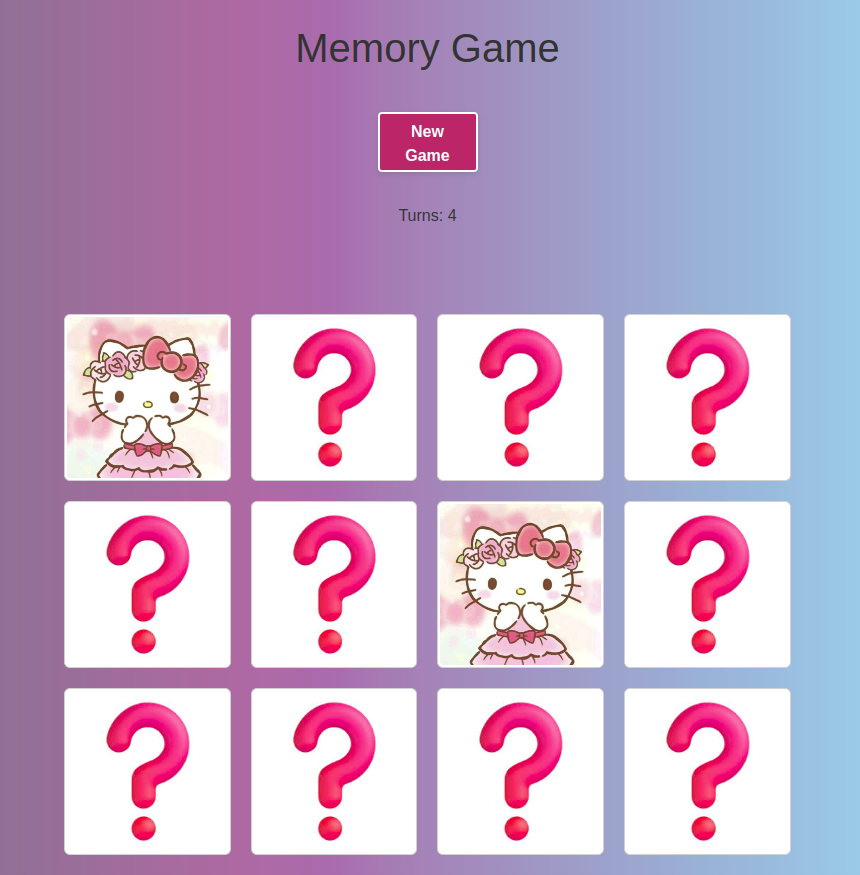
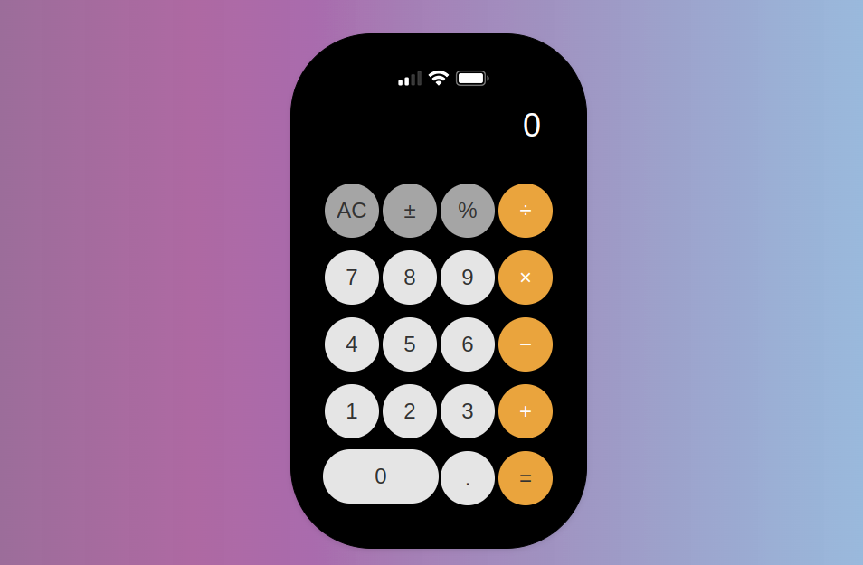

# React - Challenges


## Introduction

Hello guys, this is a project made with React. More details below. 😅

### Goal

Hi guys, this here is a little work in React by Professor Ana Carolina at my college. Challenges range from listing simple buttons to performing a memory game and iphone calculator. I hope you enjoy. 🤯

### Product Features

* 🔓 Memory Game.
* 🚀 Iphone Calculator.
* 🎨 Click Counter.

### Installation & Running Instructions

First step is to “Fork” the project under your name and keep the `main` branch always sync’d with this repository to ensure there are no issues with your Pull Request like those dreaded Merge Conflicts! 😈

The command...

```bash
$ git clone <path> <directory>
```

Then you will have to run inside the project folder...

```bash
$ npm install
```
And to run 😈

```bash
$ npm start
```

#### Same pages for you to see.
  

  And the calculator...

  

